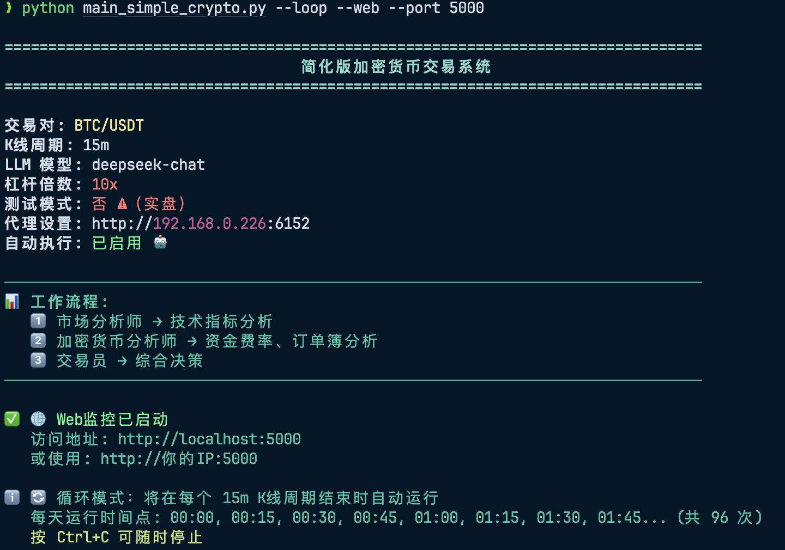
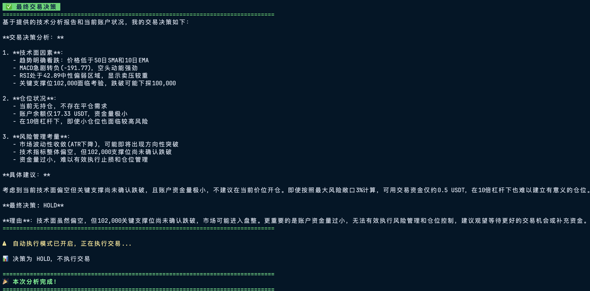

# 🚀 TradingAgents - 加密货币智能交易系统

基于多智能体 AI 框架的比特币量化交易系统，使用 LangGraph 和 LLM 驱动的智能分析决策。



## ✨ 核心特性

### 🤖 三大智能体协作
- **市场分析师** - 技术指标分析（RSI、MACD、布林带、移动平均线等）
- **加密货币分析师** - 链上数据分析（资金费率、订单簿深度、24h 市场统计）
- **交易员** - 综合决策（整合分析报告，输出具体交易建议）

### 📊 实时交易执行
- ✅ 币安期货交易（做多/做空/平仓）
- ✅ 杠杆交易（1x-125x 可配置）
- ✅ 自动交易或人工审核
- ✅ 测试模式（模拟交易，无资金风险）
- ✅ 实时持仓和盈亏追踪



### ⏰ 智能定时调度
- 🕐 **15m 周期** - 在 0, 15, 30, 45 分钟自动运行
- 🕐 **1h 周期** - 在每个整点自动运行
- 🕐 **其他周期** - 自动对齐 K 线时间（5m/30m/4h/1d）

### 🌐 Web 监控界面
- 📈 实时查看交易决策和执行结果
- 💼 展示持仓信息和盈亏状态
- 📊 显示市场分析和加密货币分析报告
- 🔄 自动刷新（每 5 秒）

### 🛡️ 安全与稳定
- 🔐 完善的 API 密钥安全指南
- 🔄 LLM 调用自动重试机制
- 📏 智能数据量控制（避免 context 超限）
- 🎯 IP 白名单支持
- 🔒 测试模式保护

---

## 📦 快速开始

### 1. 安装依赖

```bash
# 克隆项目
git clone https://github.com/Oakshen/crypto-trading-bot.git
cd TradingAgents

# 使用 uv 创建虚拟环境（强烈推荐）
uv venv --python 3.13
source .venv/bin/activate  # Linux/Mac

# 安装依赖
uv pip install -r requirements.txt
```

### 2. 配置环境变量

复制模板文件并填写配置：

```bash
cp .env.example .env
```

编辑 `.env` 文件，填入必要的 API 密钥：

```bash
# ===== 必需配置 =====

# OpenAI API Key（必需）
OPENAI_API_KEY=sk-your-openai-api-key-here

# 币安 API（实盘交易必需，测试模式可留空）
BINANCE_API_KEY=your-binance-api-key
BINANCE_SECRET=your-binance-secret

# ===== 推荐配置 =====

# LLM 模型
QUICK_THINK_LLM=deepseek-chat          # 分析师使用
LLM_BACKEND_URL=https://api.deepseek.com  # DeepSeek API

# 交易参数
CRYPTO_SYMBOL=BTC/USDT                  # 交易对
CRYPTO_TIMEFRAME=1h                     # K线周期 (15m/1h/4h/1d)
BINANCE_LEVERAGE=10                     # 杠杆倍数
POSITION_SIZE=0.001                     # 仓位大小（BTC数量）

# 安全设置
BINANCE_TEST_MODE=true                  # 测试模式
AUTO_EXECUTE=false                      # 自动执行

# 代理（如果需要）
BINANCE_PROXY=http://192.168.0.100:6000
```

**📖 完整配置说明请查看：** `.env.example`（包含每个选项的详细注释）

### 3. 运行系统

系统提供三种运行模式：

#### 🎯 模式 1：单次运行（立即执行）

适合测试或手动触发分析：

```bash
python main_simple_crypto.py
# 或
python main_simple_crypto.py --now
```


#### 🔄 模式 2：循环运行（自动定时）

根据 K 线周期自动运行：

```bash
python main_simple_crypto.py --loop
```

**工作原理：**
- 设置 `CRYPTO_TIMEFRAME=15m` → 在 0, 15, 30, 45 分钟运行
- 设置 `CRYPTO_TIMEFRAME=1h` → 在每个整点运行
- 设置 `CRYPTO_TIMEFRAME=4h` → 在 0, 4, 8, 12, 16, 20 点运行


#### 🌐 模式 3：循环运行 + Web 监控

提供网页实时监控界面：

```bash
python main_simple_crypto.py --loop --web

# 自定义端口
python main_simple_crypto.py --loop --web --port 5000
```

**访问监控界面：**
- 本地：http://localhost:5000
- 局域网：http://你的IP地址:5000

**Web 界面功能：**
- 📊 实时显示运行次数和下次运行时间
- 💼 美化的持仓信息卡片（余额、盈亏、爆仓价等）
- 📈 市场技术分析报告
- 💰 加密货币分析报告（资金费率、订单簿）
- 🤖 LLM 决策内容
- ✅ 交易执行结果（如果开启自动交易）
- 🔄 每 5 秒自动刷新

#### 🖥️ 后台运行（服务器部署）

```bash
# 使用 nohup 后台运行
nohup python main_simple_crypto.py --loop --web > logs/trading.log 2>&1 &

# 查看日志
tail -f logs/trading.log

# 停止运行
ps aux | grep main_simple_crypto
kill <进程ID>
```

---

## 🎯 使用场景

### 场景 1：测试策略（推荐新手）

```bash
# 1. 设置测试模式
# .env 文件:
BINANCE_TEST_MODE=true
AUTO_EXECUTE=false

# 2. 运行单次分析
python main_simple_crypto.py --now

# 3. 查看决策，人工判断
```

### 场景 2：人工审核交易

```bash
# 1. 配置
BINANCE_TEST_MODE=false  # 实盘模式
AUTO_EXECUTE=false       # 不自动执行

# 2. 定时运行
python main_simple_crypto.py --loop

# 3. 每次分析后，人工决定是否执行交易
```

### 场景 3：全自动交易（谨慎！）

```bash
# 1. 配置
BINANCE_TEST_MODE=false  # 实盘模式 ⚠️
AUTO_EXECUTE=true        # 自动执行 ⚠️

# 2. 后台运行 + Web 监控
nohup python main_simple_crypto.py --loop --web > logs/trading.log 2>&1 &

# 3. 通过 Web 界面监控（手机也可访问）
# 访问: http://服务器IP:5000
```

---

## ⚙️ 关键配置说明

### K 线周期和运行频率

| K线周期 | 运行时间点 | 适合交易风格 |
|---------|-----------|-------------|
| `15m` | 0, 15, 30, 45 分 | 超短线/日内高频 |
| `1h` | 每个整点 | 短线/日内交易（推荐）|
| `4h` | 0, 4, 8, 12, 16, 20 点 | 中短线波段 |
| `1d` | 每天 0:00 | 长线波段 |

### 杠杆倍数建议

| 杠杆 | 风险级别 | 适合人群 |
|------|---------|----------|
| 1-3x | 低风险 | 新手 |
| 5-10x | 中等风险 | 有经验的交易者（推荐）|
| 10-20x | 高风险 | 专业交易者 |
| 20x+ | 极高风险 | ⚠️ 不推荐 |

### 数据回看天数

系统会根据 K 线周期**自动优化**数据量，避免 LLM context 超限：

| K线周期 | 自动回看天数 | 约 K 线数量 |
|---------|-------------|-------------|
| 15m | 5 天 | ~480 根 |
| 1h | 10 天 | ~240 根 |
| 4h | 15 天 | ~90 根 |
| 1d | 60 天 | ~60 根 |

如需手动设置，在 `.env` 中添加：
```bash
CRYPTO_LOOKBACK_DAYS=10
```

---

## 🔐 安全配置

### 必做的 3 件事

**1. 确保 .env 不被 Git 追踪**

```bash
# 检查
cat .gitignore | grep .env

# 如果没有，添加
echo ".env" >> .gitignore

# 如果已经被追踪，移除
git rm --cached .env
git commit -m "chore: remove .env from tracking"
```

**2. 设置币安 API IP 白名单**

- 登录币安：https://www.binance.com/zh-CN/my/settings/api-management
- 编辑你的 API Key
- 在 "IP 访问限制" 中添加你的 IP 地址
- **这样即使 API Key 泄露，其他 IP 也无法使用！**

**3. 限制 API 权限**

币安 API 设置：
- ✅ 启用：读取（Read）
- ✅ 启用：现货与杠杆交易（Spot & Margin Trading）
- ❌ 禁用：**提现（Withdrawals）← 永远不要开启！**
- ❌ 禁用：内部转账（Internal Transfer）

### 📚 完整安全指南

查看详细的安全文档：

```bash
cat SECURITY_GUIDE.md
```

包含：
- 详细风险分析
- 所有防护措施
- 应急响应流程
- 自动检查脚本

---


## 📊 项目结构

```
TradingAgents/
├── tradingagents/
│   ├── agents/
│   │   ├── analysts/
│   │   │   ├── market_analyst.py       # 市场技术分析师
│   │   │   └── crypto_analyst.py       # 加密货币分析师
│   │   └── utils/
│   │       ├── crypto_tools.py         # 加密货币工具（数据获取）
│   │       └── agent_utils.py
│   ├── dataflows/
│   │   ├── crypto_ccxt.py              # CCXT 数据接口
│   │   └── config.py
│   ├── executors/
│   │   └── binance_executor.py         # 币安交易执行器
│   ├── graph/
│   │   └── simple_crypto_graph.py      # 简化版交易图
│   ├── utils/
│   │   ├── logger.py                   # 彩色日志工具
│   │   └── scheduler.py                # 智能调度器
│   ├── web/
│   │   ├── monitor.py                  # Web 监控服务
│   │   └── templates/
│   │       └── monitor.html            # 监控界面
│   └── crypto_config.py                # 加密货币配置
├── main_simple_crypto.py               # 主程序入口 ⭐
├── .env                                # 环境变量配置
├── env_template.txt                    # 配置模板（带详细注释）
├── requirements.txt                    # 项目依赖
├── SECURITY_GUIDE.md                   # 安全指南
└── README.md                           # 本文档
```

---

## ⚠️ 风险提示

**请务必理解以下风险：**

### 市场风险
- 加密货币市场波动性极高
- 可能面临重大损失
- 历史表现不代表未来收益

### 技术风险
- AI 决策可能出错
- 系统可能存在 bug
- 网络延迟可能影响交易

### 杠杆风险
- 杠杆放大盈利也放大亏损
- 高杠杆可能导致快速清算
- 建议新手使用低杠杆（1-3x）

### AI 局限性
- LLM 不是财务顾问
- 决策基于历史数据，无法预测未来
- 不要盲目信任 AI 建议

**建议：**
- ✅ 从测试模式开始（`BINANCE_TEST_MODE=true`）
- ✅ 从小额资金开始
- ✅ 始终设置止损
- ✅ 定期审查交易表现
- ✅ 只投入可以承受损失的资金
- ❌ 不要使用全部资金
- ❌ 不要在不理解的情况下使用高杠杆
- ❌ 不要在情绪波动时做决策

---

## 🤝 贡献

欢迎提交 Issue 和 Pull Request！

如果你觉得这个项目有帮助，请给一个 ⭐ Star！

---

## 📚 参考资料

- [TradingAgents 论文](https://arxiv.org/abs/2412.20138)
- [LangGraph 文档](https://langchain-ai.github.io/langgraph/)
- [CCXT 文档](https://docs.ccxt.com/)
- [币安 API 文档](https://binance-docs.github.io/apidocs/)
- [币安 API 安全最佳实践](https://www.binance.com/zh-CN/support/faq/360002502072)

---

## 📄 许可证

与原 TradingAgents 项目保持一致。

## ⭐ 致谢

感谢 TradingAgents 原项目团队提供的优秀框架！

---

## 📞 支持

如有问题，请：
1. 查看 [故障排除](#-故障排除) 章节
2. 查看 `SECURITY_GUIDE.md` 安全指南
3. 提交 [GitHub Issue](https://github.com/YourRepo/TradingAgents/issues)

---

**⚖️ 免责声明**: 本软件仅供研究和教育用途。使用本软件进行实盘交易的任何损失由用户自行承担。开发者不对任何交易损失负责。加密货币交易存在高风险，请谨慎投资。

---

**🔥 快速开始命令总结**

```bash
# 1. 安装
pip install -r requirements.txt

# 2. 配置
cp env_template.txt .env
nano .env  # 填入 API Key

# 3. 测试运行
python main_simple_crypto.py --now

# 4. 自动循环
python main_simple_crypto.py --loop

# 5. Web 监控
python main_simple_crypto.py --loop --web
```

**祝交易顺利！** 🚀📈
